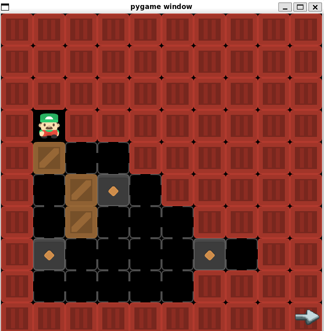

# 🚀 Optimize-to-Rank with Bidirectional Search



This project enhances the learning search mechanism by shifting the optimization goal from merely reaching a specific goal state to optimizing the **rank** of the solution path. A key feature is the integration of **bidirectional search** to improve efficiency and exploration.

---

## 💡 Overview

Traditional search algorithms often optimize for the shortest path to a goal. This project introduces a paradigm where the search is optimized to rank the discovered solution, potentially allowing for the discovery of more relevant or efficient paths beyond just the absolute minimum cost. The inclusion of **bidirectional search** significantly speeds up the search process by simultaneously searching from the initial state and the goal state, meeting somewhere in the middle.

---

## 📁 Project Structure

The code is organized into packages by responsibility:

```
game/        Sokoban game logic & data loading (SokobanGame, getData, …)
search/      Search algorithms (AI_Bidirectional/TTBS, AnchorSearch, astar)
learning/    Learned heuristic: model (nn), replay_buffer, online_run driver
analysis/    Offline analysis & plotting (analyze_optimality, results, …)
viz/         Pygame visualization helpers
tests/       Tests
data/        Puzzle datasets (states10_3box.txt, test_box.txt)
main.py      Pygame application entry point (run from repo root)
```

Run scripts from the **repo root** as modules so package imports resolve, e.g.:

```bash
# Online learned-heuristic training/eval curve (CPU default)
python -m learning.online_run

# Same, with heavy training on Apple-Silicon GPU (MPS)
TRAIN_DEVICE=mps BATCH_SIZE=256 UPDATES_PER_SOLVE=32 BUFFER_CAP=100000 python -m learning.online_run

# Optimality analysis (expanded nodes vs path length)
python -m analysis.analyze_optimality

# Pygame app
python main.py
```

`learning/online_run.py` reads optional env knobs: `N_TOTAL`, `MODEL_CHANNELS`,
`BATCH_SIZE`, `UPDATES_PER_SOLVE`, `BUFFER_CAP`, `LOSS={mse,rank,both}`,
`REG_LOSS={mae,mse}`, `USE_G={yes,no}`, `TRAIN_DEVICE={cpu,mps}`, `K_REMINE`.

---

## 🔧 Program Details and Usage

The project can be run with various configurations controlled by command-line arguments.

### 📋 Prerequisites

This project requires **Python 3.x** and uses **Conda** for environment management to ensure all dependencies (including `pygame` for visualization) are correctly installed and isolated.

**Installation Steps:**

1.  **Preferred Method (Using `environment.yaml`):**

    If you have the necessary Conda channels configured (like `conda-forge`), use the YAML file to create the environment:

    ```bash
    # Create and activate the environment using the YAML file
    conda env create -f environment.yaml
    conda activate optimize-to-rank
    ```

2.  **Alternative Method (Using `spec-file.txt`):**

    If the YAML method fails due to channel or dependency issues, use the strict specification file to create the environment directly:

    ```bash
    # Create the environment using the specification file
    conda create --name optimize-to-rank --file spec-file.txt
    conda activate optimize-to-rank
    ```
    
### 💻 How to Run

After activating the environment (`conda activate optimize-to-rank`), run the program with the desired arguments.

The general format for execution is: `python main.py [optional arguments]`

#### Common Use Cases

| Goal | Command | Description |
| :--- | :--- | :--- |
| **Default Run** | `python main.py` | Runs with **Visuals (Pygame)**, in **Automatic** mode, using **Forward Search**. |
| **Interactive Debugging** | `python main.py --iteration_type "step"` | Runs with **Visuals**, pausing at each step, requiring input (e.g., arrow key) to advance. |
| **Compare Bidirectional Performance** | `python main.py --with_or_without_pygame "False" --forward_or_bidirectional "bidirectional"` | Runs the fastest, non-visual search using the **Bidirectional** method. |
| **Visual Bidirectional Search** | `python main.py --forward_or_bidirectional "bidirectional"` | Runs with **Visuals** in **Automatic** mode using the **Bidirectional** search. |

#### Argument Breakdown

You can combine any of the following arguments:

* **`--with_or_without_pygame`**: Set to `"False"` to disable visualization for faster, headless execution. (Default: `"True"`)
* **`--iteration_type`**: Set to `"step"` to control the execution step-by-step. (Default: `"auto"`)
* **`--forward_or_bidirectional`**: Set to `"bidirectional"` to enable the dual-direction search strategy. (Default: `"forward"`)


## 📊 State File Structure Reference

The environment is loaded from files like `states10_3box.txt`, which define the grid using integer mappings.

### 🗺️ Grid Cell Mapping

Each cell in the input grid file corresponds to the following elements:

| Value | Element | Description |
| :---: | :--- | :--- |
| **`0`** | Walls | Impassable barriers. |
| **`1`** | Floor | Moveable space where the player can walk. |
| **`2`** | Target Block Locations | Goal spots where the blocks must be pushed. |
| **`3`** | Player Location | The starting position of the agent. |
| **`4`** | Block Locations | Blocks that are to be pushed. |
### 📦 Block Locations

* **`4`**: **Where the Blocks Currently Are** (This value represents a movable block or box).

**Note:** The primary task when processing the grid is to convert all cells with the value `4` into a dynamic list of **(row, column) coordinates** to accurately track their positions throughout the search process.